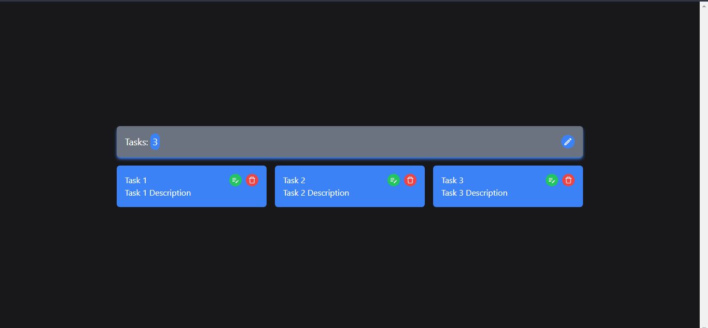
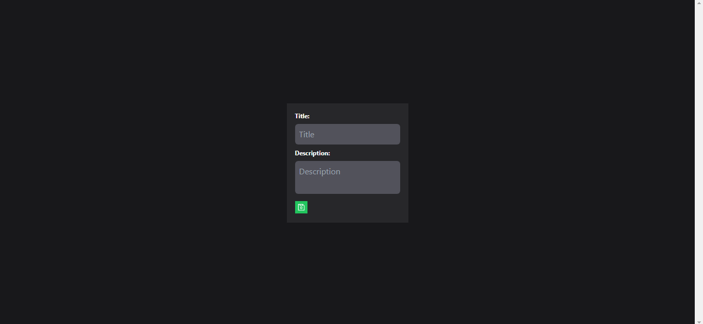
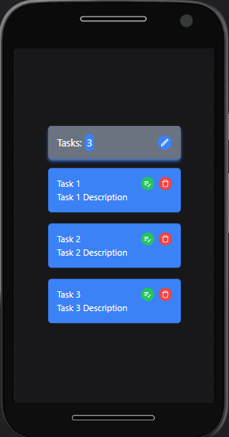
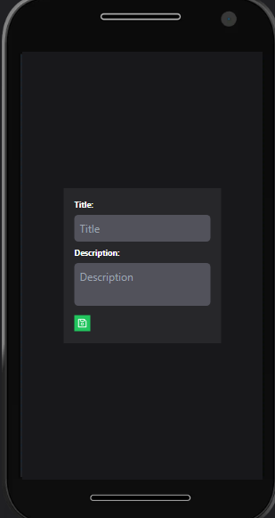

# React RTK Crud

## Descripción

Código base del ejemplo react-rtk-crud donde se realiza un crud para entender los conceptos basicos de redux, redux toolkit y Tailwind CSS.

---

## Vista En Versión Desktop

## Vista En Versión Mobile

---

## Enlace A La Aplicación

- [React RTK Crud](https://redux-rtk-crud.netlify.app/)

---

## Comandos

- npm i
- npm run dev
- npm run build

## Dependencias

- React
- React DOM
- React Icons
- React Redux
- React Router DOM
- Redux/toolkit
- SweetAlert2
- uuid

## Dependencias De Desarrollo

- Autoprefixer
- Prettier
- Prettier Plugin Tailwind CSS
- Post CSS
- Tailwind CSS
- Vite
