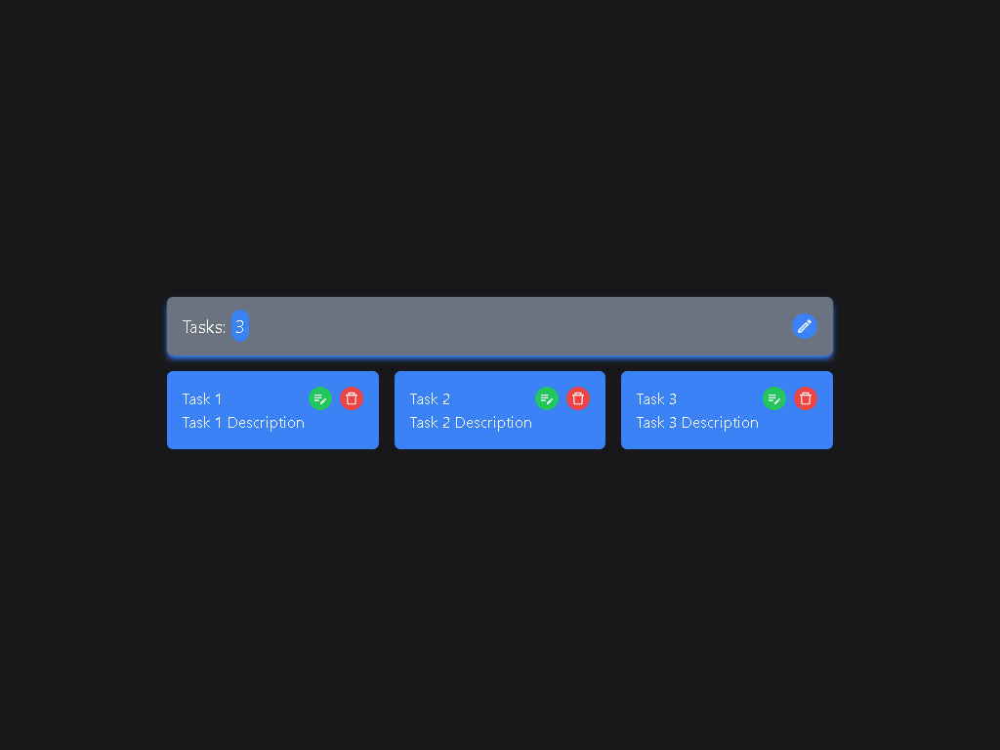
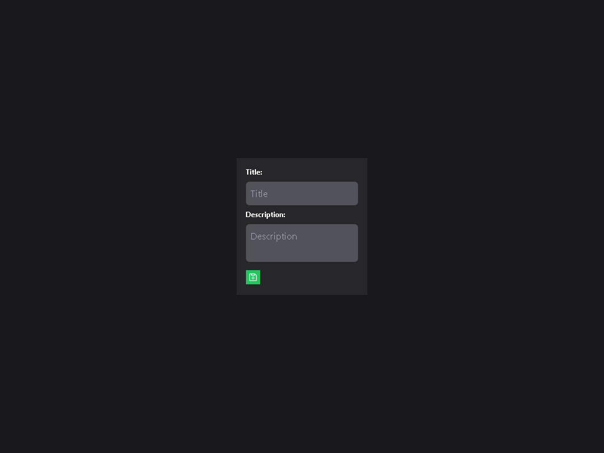
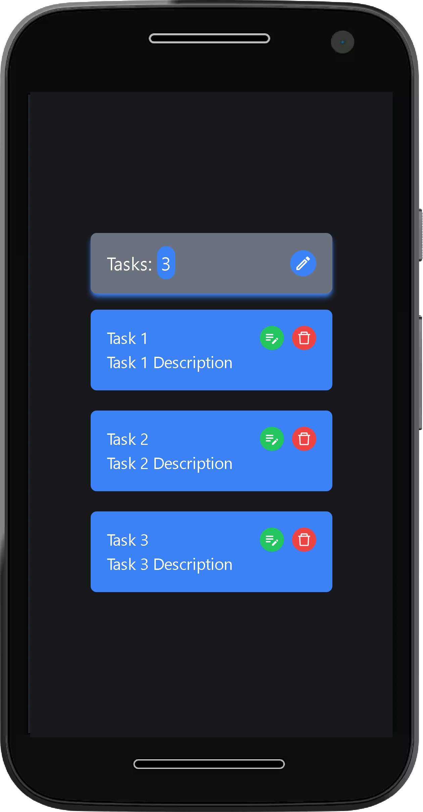
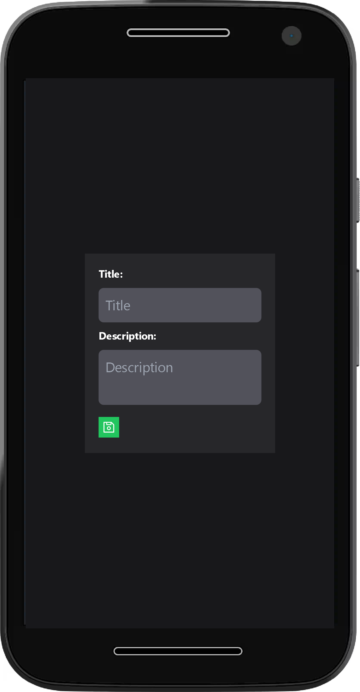

# Tasks Pending

## Descripción

Código base de la Interfaz Tasks Pending hecha en React, Redux, Redux Toolkit y Tailwind CSS.

---

## Vista En Versión Desktop

## Vista En Versión Mobile

---

## Enlace A La Aplicación

- [Tasks Pending](https://tasks-pending.netlify.app/)

---

## Hecho con

- [React](https://react.dev/) - JS Library
- [React Icons](https://react-icons.github.io/react-icons/) - For Icons
- [React Redux](https://react-redux.js.org/) - For Redux in React
- [React Router](https://reactrouter.com/en/main) - For Routes
- [Redux/toolkit](https://redux-toolkit.js.org/) - For State Management
- [SweetAlert2](https://sweetalert2.github.io/) - For Alerts
- [Tailwind CSS](https://tailwindcss.com/) - For Styles
- [UUID](https://github.com/uuidjs/uuid#readme) - For Random IDs

---

## Comandos

- npm i
- npm run dev
- npm run build

---

## Dependencias

- React
- React DOM
- React Icons
- React Redux
- React Router DOM
- Redux/toolkit
- SweetAlert2
- uuid

---

## Dependencias De Desarrollo

- Autoprefixer
- Prettier
- Prettier Plugin Tailwind CSS
- Post CSS
- Tailwind CSS
- Vite

---

## Autor

- Website - [Axe10rellana](https://axe10rellana.github.io/portafolio/portafolio/)