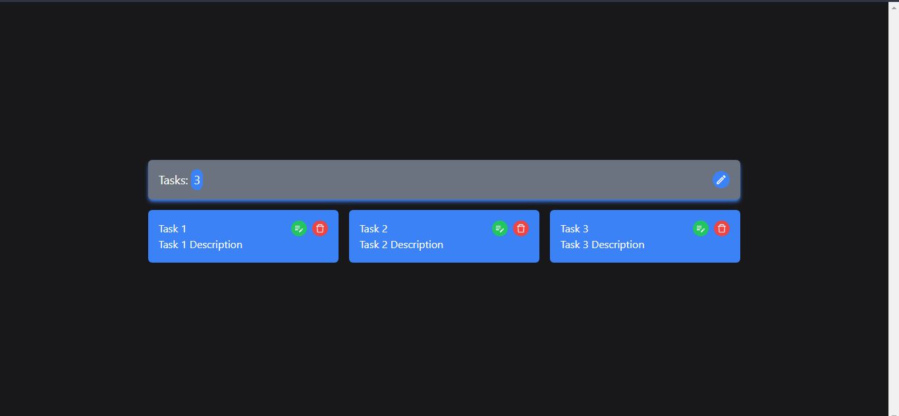
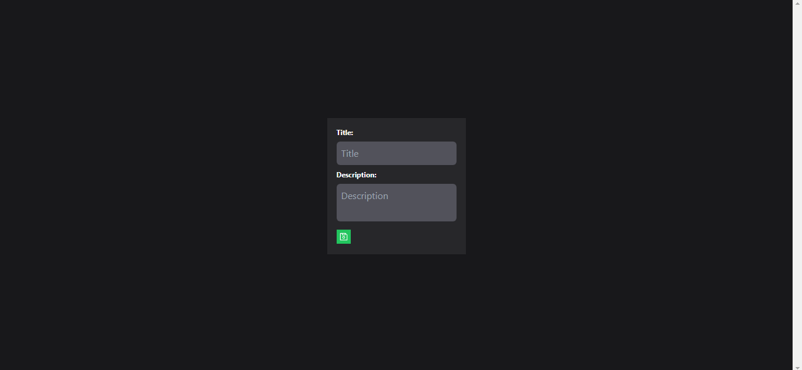
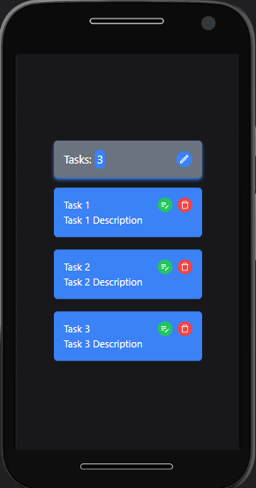
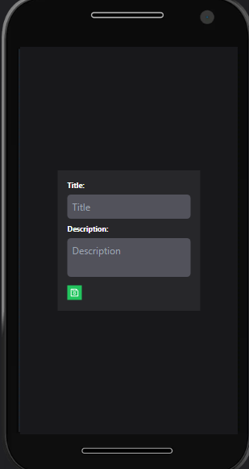

# Tasks Pending

## Descripción

Código base de la Interfaz Tasks Pending hecha en React, Redux, Redux Toolkit y Tailwind CSS.

---

## Vista En Versión Desktop

## Vista En Versión Mobile

---

## Enlace A La Aplicación

- [Tasks Pending](https://tasks-pending.netlify.app/)

---

## Comandos

- npm i
- npm run dev
- npm run build

## Dependencias

- React
- React DOM
- React Icons
- React Redux
- React Router DOM
- Redux/toolkit
- SweetAlert2
- uuid

## Dependencias De Desarrollo

- Autoprefixer
- Prettier
- Prettier Plugin Tailwind CSS
- Post CSS
- Tailwind CSS
- Vite
